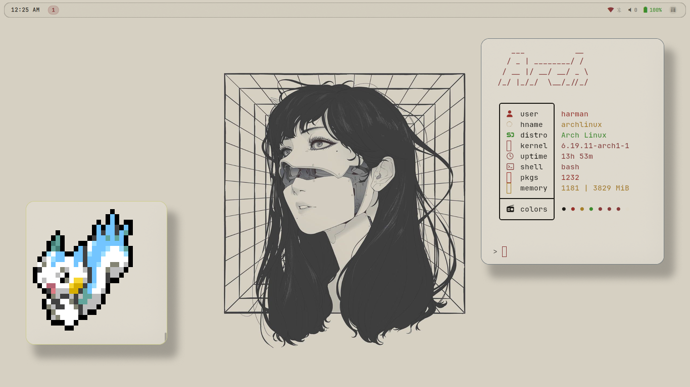
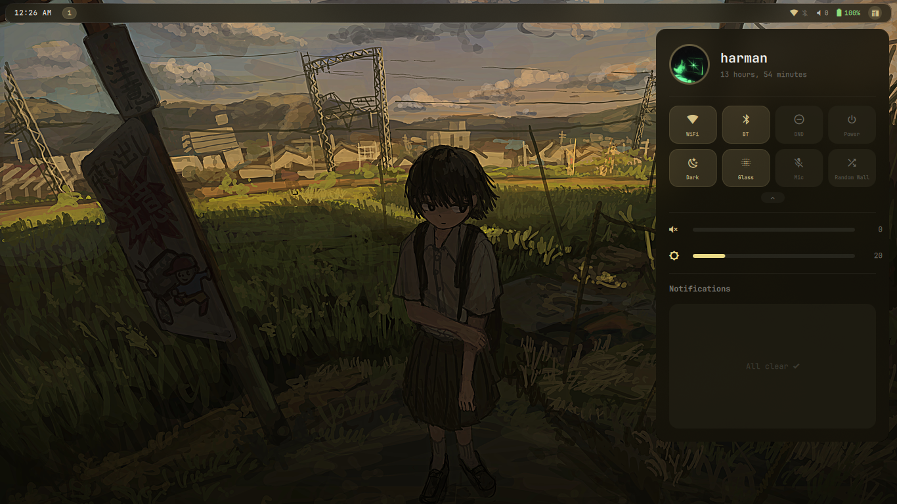
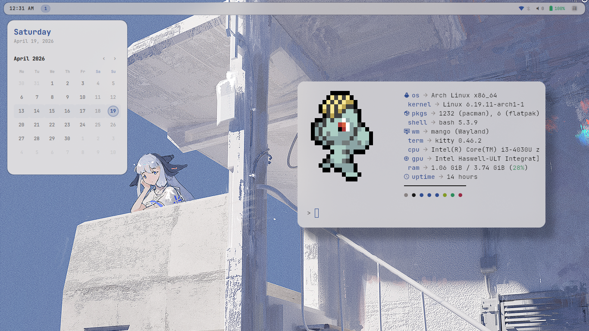

# Alphonso

Probably the best dots for MangoWM. 

## The idea

Most rices look good with one specific wallpaper and color scheme. This one tries to look good with whatever you throw at it by extracting colors from the image and propagating them everywhere.

It won't work perfectly on every wallpaper. some have weird colors, some are too complex, some just don't extract well. But for 90% of wallpapers, it does exactly what you want without touching a config file.

Also has 5 different animation profiles (bubbly, calm, snappy, extraslow, none) 

---

## What's actually cool about it

**Color extraction** — I wrote a Python script (`iris.py`) that uses k-means clustering in LAB color space to pull colors from wallpapers. It generates backgrounds, foregrounds, accents, and even syntax highlighting colors. Then writes them to:
- Kitty (live via socket, no restart needed)
- Neovim (generates a lua colorscheme)
- GTK apps (writes CSS to gtk-3.0 and gtk-4.0)
- MangoWM window borders

Switch wallpapers in the picker, watch everything recolor in real time. It's weirdly satisfying. 

**3D wallpaper carousel** — Because a grid is boring. Spins around, shows previews, plays GIFs and videos in the center card. Press R for random. 

**Lockscreen** — Plays video/GIF wallpapers (with blur), uses Python PAM for auth (no artificial delays), shows your profile picture.

**Everything is modular** — Don't like the bubbly animations? Switch to snappy. Don't want blur? Turn it off. Want sharp corners? Set radius to 0. 

---

## Screenshots






---

## What's in the stack

| Thing | Tool |
|-------|------|
| **Window Manager** | [mango-ext](https://github.com/ernestoCruz05/mango-ext) (fork of MangoWM, which is a fork of DWL) |
| **Panels/Widgets** | [Quickshell](https://github.com/outfoxxed/quickshell) (QML-based) |
| **Terminal** | Kitty |
| **Editor** | Neovim |
| **Lockscreen** | Quickshell + python-pam |
| **Notifications** | Tiramisu → Quickshell |
| **Wallpaper Daemon** | awww-daemon |
| **Video Wallpapers** | mpvpaper |
| **Music Visualizer** | cava (12 bars) |

---

## Installation

I've only tested this on my laptop. It'll probably work on yours too. **Install script only works on Arch, btw.**

```bash
git clone https://github.com/Harman1307/Alphonso.git
cd Alphonso
chmod +x install.sh
./install.sh
```

The script:
- Installs all dependencies (builds mango-ext from source)
- Backs up your existing dotfiles to `~/.dotfiles-backup-<timestamp>`
- Copies everything to `~/.config/`
- Sets up the PAM service for the lockscreen
- Creates cache and state directories

**After install:**
1. Log out
2. Select MangoWM (or mango-ext) from your login manager
3. Log in
4. Run `~/.config/scripts/random-wallpaper.sh` to set your first wallpaper

Everything should just work. If it doesn't, check the GitHub issues or open a new one.

---

## Features (the actually interesting ones)

### Color Extraction

`iris.py` is a Python script that takes a wallpaper and spits out a full color scheme. It:
- Downscales the image to 150x150 for speed
- Uses k-means clustering in LAB color space (14 clusters)
- Picks the most spatially dominant cluster as the background
- Generates accent, foreground, dim, and surface colors
- Creates 8 syntax highlighting colors for code
- Auto-detects if it should be dark or light mode (Right click on dark mode in the dashboard if you want to lock one specific mode.)

Colors are cached per wallpaper. If you switch back to a wall you've used before, it's instant.

**Known issues:**
- Some complex wallpapers (lots of gradients or competing colors) extract weird palettes

### Animation Profiles

Five profiles that change both Quickshell animations and MangoWM window behavior:

- **bubbly** — springy, bouncy, overshoots. Default. Fun.
- **calm** — slow, smooth, macOS-ish. Lofi cafe vibes.
- **snappy** — fast, tight, no bounce.
- **extraslow** — very slow and refined. 
- **none** — instant. No animations. 

You manually switch them in the dashboard. 

### Lockscreen

Built in Quickshell:
- Shows time, date, profile picture
- Plays video/GIF wallpapers (same as your desktop wall)
- Blur intensity tied to your blur profile setting
- Python PAM authentication (custom service, no artificial delay)
- Shake animation + red border on wrong password
- Dots show password length (max 24 visible)

**Security note:** `killall quickshell` bypasses it. This isn't a high-security lockscreen. If you need real security, use something else.

### Wallpaper Picker

Fullscreen 3D carousel because I got bored of grid pickers:
- Cylinder layout with 5 cards visible (center + 2 on each side)
- Center card shows full preview, sides show cropped thumbs
- GIFs play animated in the center
- Videos play muted/looping via QtMultimedia
- Search with `/` (filters by filename)
- `R` picks a random wallpaper
- `Enter` applies the center card
- `H/L` or arrow keys to navigate

Thumbnails are cached at 600px wide. First load is slow, then it's instant.

**Video wallpapers:** When you apply a video, it extracts the first frame with ffmpeg, uses that for iris color extraction, shows it with awww for 1.5 seconds, then starts mpvpaper in the background. Seamless.

### Media Widget

Top-center dropdown that shows what's playing:
- Title marquee scrolls if it's too long
- Artist + title display
- Seek bar with live position (you can click to scrub)
- Play/pause, prev, next buttons
- Two display modes:
  - **GIF mode** — plays an animated GIF from `~/.config/quickshell/assets/gifs/` synced to playback state
  - **Vinyl mode** — spinning vinyl record with album art overlay (you can stop or move by clicking the vinyl)
- 12-bar visualizer (cava) at the bottom

Supports anything playerctl supports (Spotify, mpv, Firefox, mpd, etc).

### Dashboard

Right-side panel with:
- Profile picture (click to change, images in `assets/pfps/`)
- Username + uptime
- Power menu (shutdown, reboot, lock, sleep, logout)
- 11 quick setting tiles:
  - WiFi, Bluetooth, DND, Night Light
  - Dark mode, Transparency, Animations, Blur
  - Power profile, Bar mode, Border radius
- Volume and brightness sliders
- Notification center (grouped by app, expandable)

Notifications are grouped by app name with a count badge. Click the group header to expand and see all notifications from that app. Click the X to dismiss the whole group or individual notifications.

### Keybinds (Only the important ones)

| Key | Action |
|-----|--------|
| `Super + Return` | Open terminal |
| `Super + Shift + Return` | Open floating terminal |
| `Super + D` | App launcher |
| `Super + W` | Wallpaper picker |
| `Super + E` | File manager (Thunar) |
| `Super + X` | Lock screen |
| `Super + Shift + Q` | Kill focused window |
| `Super + Shift + Space` | Toggle floating |
| `Super + F` | Fullscreen |
| `Super + H/J/K/L` | Focus window (vim keys) |
| `Super + Shift + H/J/K/L` | Move window |
| `Super + 1-5` | Switch workspace |
| `Super + Shift + 1-5` | Move window to workspace |
| `Super + T` | Dwindle layout |
| `Super + Shift + T` | Tile layout |
| `Super + C` | Canvas layout |
| `Super + S` | Scroller layout |

Full list in `~/.config/mango/config.conf`. Feel free to change them.

---

## File structure 

```
~/.config/quickshell/
├── iris/iris.py              # Color extraction script
├── state/
│   ├── settings.json         # Saved settings (dark mode, profiles, etc)
│   └── app_usage.json        # Launcher frecency data
├── assets/
│   ├── pfps/                 # Profile pictures (jpg/png)
│   └── gifs/                 # GIF assets for media widget
├── Colors.qml                # Color singleton
├── UIState.qml               # Global state 
├── Animations.qml            # Animation profile definitions
├── Dashboard.qml
├── Launcher.qml
├── Wallpaper.qml
├── Music.qml
├── Calendar.qml
├── Lockscreen.qml
├── NotificationPopup.qml
└── Bar.qml

~/.config/mango/
└── config.conf               # MangoWM config

~/.cache/qs/
├── kitty-colors.conf         # Generated kitty colors (sourced by kitty.conf)
└── lock                      # Touch this to trigger lockscreen

~/.cache/wallpaper-thumbs/
├── walls.json                # Cached wallpaper list
└── *.thumb.jpg               # Generated thumbnails

~/.cache/wallpaper-colors/
└── *.json                    # Cached color schemes per wallpaper
```

Colors.qml runs `iris.py` when you change wallpapers, parses the JSON output, and triggers updates across the system. UIState handles everything else (media state, notifications, settings persistence, MangoWM communication).

---

## Known issues

- **Color extraction isn't perfect.** Some wallpapers just don't work well. If you get a bad palette, switch wallpapers.
- **Lockscreen isn't secure.** Killing quickshell bypasses it. It's a convenience lock, not a vault.
- **First wallpaper thumbnail generation is slow.** It runs in the background. Wait a minute before opening the picker.
- **Swayidle might still lock during videos sometimes.** The playerctl check is 99% reliable but not perfect.

---

## Credits

- [MangoWM](https://github.com/mangowm/mango) 
- [mango-ext](https://github.com/ernestoCruz05/mango-ext) by ernestoCruz05 
- [Quickshell](https://github.com/outfoxxed/quickshell) by outfoxxed 
- r/unixporn for endless inspiration and impossible standards

---

## License

MIT. Do whatever you want with it.

---

**Thanks for checking this out. If you install it, let me know how it goes :D**
